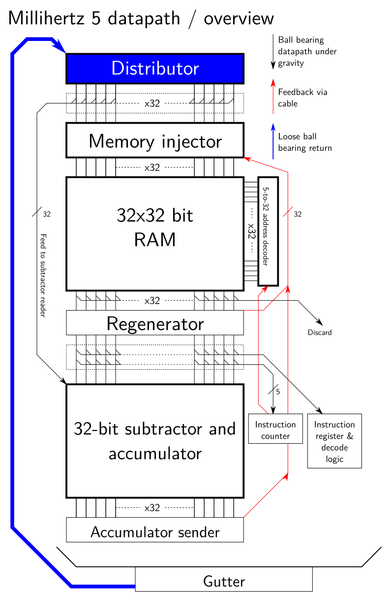

# Millihertz Model F ("Offspring")

This is a project to create a working replica of the Manchester small-scale experimental machine, otherwise known as the Manchester Baby.

It will be implemented fully mechanically, that is, without any electronic or electric components. All power must be taken from a single rotating shaft input.

The finished machine should be a complete, binary-compatible implementation of the original SSEM, capable of running the same programs.

It will be significantly slower than the original machine. It is meant to operate at about one cycle every 10 seconds (100mHz) compared to the 1kHz+ operation of the original machine.

The goal of this machine is to act as a visual demonstration of the operation of a stored-program computer, and to demonstrate that computation is a concept independent of current technologies such as photo-etched silicon.

## Overview diagram

The machine is organised to take as much advantage of gravity as possible. The datapath is from the memory into the subtractor and accumulator and is 32 bits wide, as was the original SSEM. The first unit at the top of the machine, the 'Distributor', is responsible for measuring exactly 32 ball bearings and spreading them out so they are the right distance apart. In the machine, a ball bearing in one column indicates a '1' and no ball bearing indicates a '0'. The distributor starts by putting a '1' in each column, but some will be discarded later.

## Memory unit
Skipping the 'memory injector' for the moment, the 32x32 bit RAM captures ball bearings coming in from the top and stores them in one selected row. At a later time, any of the rows can be ejected so their pattern of data goes back into the data path. Reading the RAM is destructive (much like ferrite core storage) so we must re-add the ball bearings to the top of the RAM after reading if we want to keep the same pattern in memory.

Below the memory is a unit called the regenerator which achieves this. The regenerator determines whether a ball bearing is present, and if so, triggers the memory injector by means of a cable or rod. There are 32 cables or rods connecting the regenerator to the injector. When one is pulled down, the injector releases one of the ball bearings (which came out of the distributor) into the memory. There's also a separate control to discard any unused ball bearings in the injector.

The regnerator also passes the ball bearings it samples on to the subtractor, so the data is duplicated - one copy to refresh the memory and one copy to do the calculation requested.

The subtractor - accumulator has its own page at [[docs/subtractor-accumulator.md]].

The output from memory, after regeneration, can also be diverted into the instr
uction register (during instruction fetch) and instruction counter (during a branch operation). Most of the data word is discarded during this, as the instruction register is only 8 bits wide, and the instruction counter is only 5 bits wide. The instruction counter is a 5-bit version of the same technology used for the subtractor-accumulator.

A diverter immediately below the memory discards the read value; this is used when we are performing a store, as the value previously held in memory should not be regenerated.

Finally, at the bottom, all discarded ball bearings are collected and recirculated (perhaps by conveyor belt) to the distributor.
