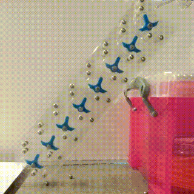
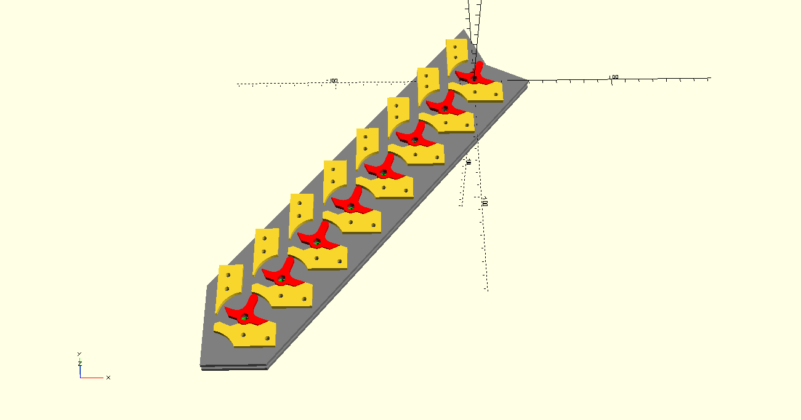

# Subtractor-accumulator unit

The subtractor-accumulator sits below the memory, after the memory discard and splitters which divert to the intruction counter and register. The inverted T-shaped pieces rotate left or right to represent 1 or 0 respectively. Dropping a ball bearing into any of the input columns subtracts that value from the accumulator (the right hand column is 1, and the left 128). Subtracting 1 from 0 results in the ball bearing falling left and into the next column, so it leaves 1 in its original column and subtracts twice its value from the next column to the left. This continues until the ball bearing subtracts 1 from 1, at which point it falls to the right, or overflows out of the left of the machine.

The design of the subtractor means it maintains its value automatically, so it's not necessary to keep a separate acumulator.

This is not my own design; there are several examples of cascading binary adders like this on the internet (TODO: where?). I've made a couple of modifications: The input senses are reversed so it functions as a subtractor rather than an adder, and it also has a second plane which can be used to copy the value in it without altering it. This requires 32 ball bearings to be dropped in on the 'read' plane, and these also come from the distributor, via the diverter valve just below it.