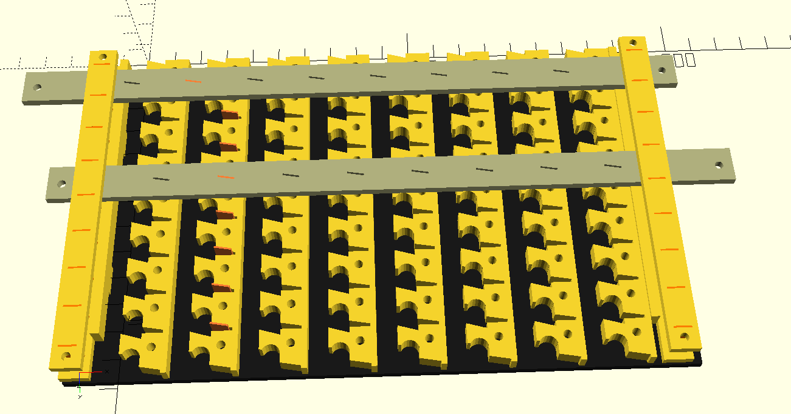

# Vertical memory unit

The above rendering shows an example 8x8 memory cell. Two grey 'row select' bars are shown - there would normally be eight, but most have been removed to show the working. Most of these row select bars are pushed to the right. One, the selected row, is pushed to the left. Eight short strips of brass are embedded into the selector bars, which normally sit in a small pocket in the RAM. When pushed right, the brass strips enter the long channels in the memory, where they will intercept ball bearings rolling down that channel.

To write data into the memory, one row is selected by pushing the corresponding row left, and a pattern of ball bearings is dropped into the channels running down the memory. A ball bearing represents a binary '1' and no ball bearing represents zero. When the ball bearings reach the selected row, the ball bearing is deflected right and into a small storage area.

When the selected row is returned to its normal position, the brass strip passes underneath the captured ball bearing, lifting it slightly but leaving it in its position.

The ball bearings remain in that row until the same row is selected again. When a row is selected while there is data in it, that data is pushed to the left and falls down the channel and out of the bottom of the RAM module. In that manner, the data stored when the row was initially selected is now read out of the memory. Reading is destructive; if you want to keep the same value in memory, you must duplicate the pattern of ball bearings and feed into the top of the RAM unit again. Magnetic core memory also had destructive reads, and regenerated memory locations in a similar way.